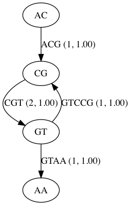
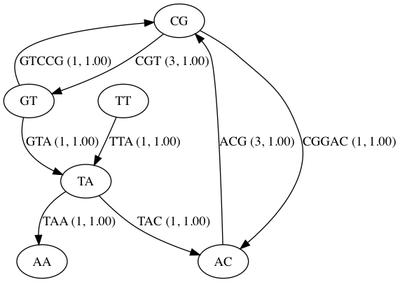

# cmpb-hmw2

### Part 1: Here is an illustration of the in-class example
#### Sequence: 'ACGTCCGTAA' with kmer = 2
* Here is what the forward kmer representation looks like

* Here is what both the forward and reverse kmer representation looks like

### Part 2: Here is an illustration of the s_6.first1000.fastq file
* Only using the forward kmer example for k = 21
(This image cannot be displayed for the both forward and reverse complement kmers due to size limits)

* For k=55, I was unable to produce any visually useful illustrations since the files were to big to get any useful resolution. Pdf renderings also truncated certain portions of the image.

* In this folder, I have attached the dot file structure for both the forward and reverse complement kmer of size 55. I have also included the dot files for the no-tip and low-coverage cases. The are named graph_55mer, graph_55mer_lowCov and graph_55mer_notips

